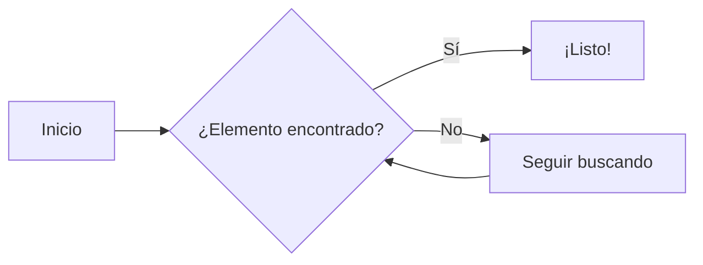
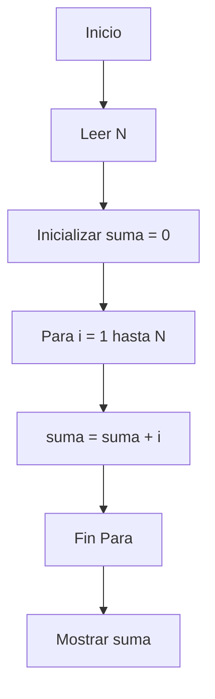

# 📚 Algoritmia Elemental

---

## 📚 Índice General

📘 [1. Fundamentos](#1-fundamentos)  
💣 [2. Caso Peor](#2-caso-peor)  
⚙️ [3. Operación Elemental](#3-operacion-elemental)  
🧩 [4. Ejemplos Interactivos](#4-ejemplos-interactivos)  
🧠 [5. Mini Reto / Quiz](#5-mini-reto--quiz)  
📚 [6. Referencias](#6-referencias)  

---

## 📘 1. Fundamentos

🔸 🔍 **Definición de Algoritmo**

Un algoritmo es un conjunto finito de instrucciones que describe un proceso para resolver un problema o llevar a cabo una tarea.  
Es esencial que sea:

- 📌 **Claro**: instrucciones no ambiguas.  
- ⏱️ **Finito**: debe terminar.  
- 🔁 **Ordenado**: pasos secuenciales.  
- 🧮 **Preciso**: definido para cada entrada.  

Ejemplo de algoritmo diario:

```text
1. Tomar una taza.
2. Servir café.
3. Añadir azúcar.
4. Revolver.
```
<br>

🔸 📏 **Propiedades de los Algoritmos**

| Propiedad       | Descripción |
|-----------------|-------------|
| **Finitud**     | Termina tras un número finito de pasos. |
| **Entrada**     | Tiene al menos una entrada. |
| **Salida**      | Produce al menos una salida. |
| **Efectividad** | Todas las operaciones son básicas y efectivas. |
| **Claridad**    | Cada paso es preciso y definido. |
<br>

🔸 📊 **Formas de Representación**

- 🔤 Lenguaje Natural (estructurado)  
- 🧾 Pseudocódigo  
- 🧭 Diagramas de flujo  
- 💻 Código en un lenguaje de programación  

```plaintext
Algoritmo: Calcular el doble de un número
Entrada: n
Salida: 2n

Inicio
   Leer n
   resultado ← n * 2
   Escribir resultado
Fin
```

---

## 💣 2. Caso Peor

🔸 **😱 ¿Qué es el Caso Peor?**

El caso peor analiza la ejecución del algoritmo en el escenario más desfavorable, es decir, donde consume más recursos (tiempo o memoria).  

🧠 Se utiliza para establecer la **cota superior** del comportamiento de un algoritmo.

📌 Notación habitual: **O(n)**, **O(n²)**, etc.

<br>

🔸 **🔍 Ejemplo Visual**

Búsqueda lineal:

```plaintext
Lista = [3, 5, 7, 9, 12]
Buscar 12
```

📈 Mejor caso: está en la primera posición → **1 operación**  
💣 Peor caso: está al final o no está → **n operaciones**



<br>

🔸 **📌 Comparación con otros casos**

| Tipo de Caso   | Descripción                  | Complejidad |
|----------------|------------------------------|-------------|
| Mejor caso     | Escenario más favorable      | O(1)        |
| Caso promedio  | Valor esperado               | O(n/2) ≈ O(n) |
| Peor caso      | Escenario más desfavorable   | O(n)        |

---

## ⚙️ 3. Operación Elemental

🔸 **🔧 ¿Qué es una Operación Elemental?**

Una **operación elemental** es la unidad más básica que un algoritmo realiza.  
Ejemplos:

- ➕ Suma o resta  
- 🔁 Comparación  
- ✍️ Asignación  
- 🔄 Intercambio  

👀 Se usa como base para **contar operaciones** y así determinar la **eficiencia** del algoritmo.

<br>

🔸 **🧠 Ejemplo con pseudocódigo**

```plaintext
Algoritmo: Sumar los primeros N números
Entrada: N
S = 0                  // 1 operación
Para i = 1 hasta N     // N veces
   S = S + i           // N operaciones
Fin
```

🔍 Total de operaciones elementales ≈ 2N + 1 ⇒ **O(n)**

<br>

🔸 **⚠️ Importancia**

✅ Nos permite:

- Analizar la eficiencia sin depender del lenguaje.
- Medir la escalabilidad.
- Comparar algoritmos de manera justa.


---

## 🧩 4. Ejemplos Interactivos



---

## 🧠 5. Mini Reto / Quiz

<details>
<summary>🧠 Preguntas</summary>

1. ¿Qué propiedad garantiza que un algoritmo no se ejecute para siempre?  
2. ¿Cuál es la diferencia entre caso peor y caso promedio?  
3. Si un algoritmo hace `n²` comparaciones, ¿cuál es su complejidad?

</details>

<details>
<summary>✅ Respuestas</summary>

1. **Finitud**  
2. El **caso peor** es el peor escenario posible; el **promedio** es el comportamiento general esperado.  
3. **O(n²)**  

</details>

---

## 📚 6. Referencias

- Brassard, G. & Bratley, P. (2002). *Fundamentos de Algoritmia*. Prentice Hall.  
- Cormen, T., et al. (2009). *Introduction to Algorithms*. MIT Press.  

---

<p align="center">
  
</p>
